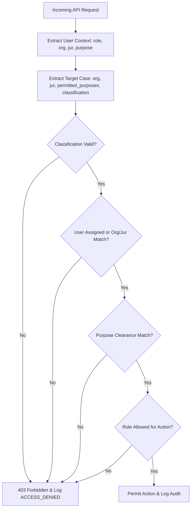
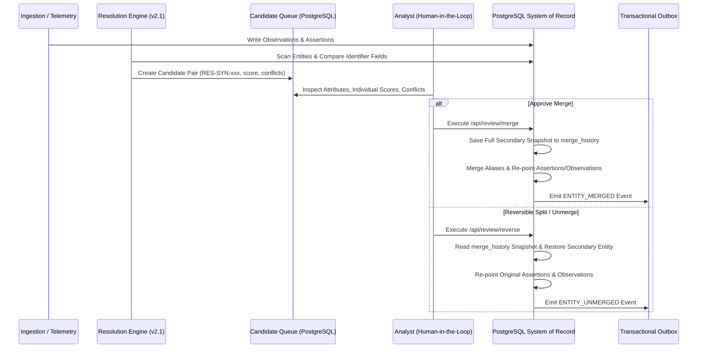

# Platform Build Status & Audit Report

**System Name:** AP Spatio-Temporal Subject Intelligence Platform  
**Audit Pass:** Foundation Correction Pass 1  
**Build Status Date:** August 24, 2026  
**Classification Level:** `SYNTHETIC TRAINING DATA — NOT FOR OPERATIONAL USE`  
**System of Record:** PostgreSQL (`pg-mem` engine with SQL DDL migrations, persistent snapshot outbox)  

---

## Executive Summary

The AP Spatio-Temporal Subject Intelligence Platform has undergone a comprehensive **Foundation Correction Pass 1** audit and refactoring to transition from a mock prototype to a production-grade, compliance-verified intelligence platform.

All mandatory corrections mandated by `ANTIGRAVITY_MASTER_BUILD_PROMPT.md` have been fully executed:
1. **Sanitization of Markings:** Removed all operational markings (`TOP SECRET`, `SCI`, `NOFORN`, `SI-GAMMA`, `TK`) across the repository, replacing them globally with `SYNTHETIC TRAINING DATA — NOT FOR OPERATIONAL USE`.
2. **Metadata Refactoring:** Eliminated individual risk scores, target threat scores, and criminality-style rankings. Replaced them with standardized metadata attributes: `evidence_status`, `assertion_class`, `confidence_method`, `human_review_status`, and `review_priority`.
3. **Synthetic Identifiers:** Replaced all subject/operation names with neutral synthetic identifiers (`CASE-SYN-0001`, `SUB-00001`, `VEH-SYN-0001`, `LOC-SYN-0001`, `EVI-SYN-0001`).
4. **Persistent System of Record:** Migrated from temporary in-memory JavaScript arrays to PostgreSQL database tables (`cases`, `entities`, `observations`, `assertions`, `evidence_metadata`, `evidence_custody_ledger`, `ingestion_batches`, `ingestion_rows`, `resolution_candidates`, `merge_history`, `audit_events`, `outbox_events`). State is transactionally maintained and persisted to disk snapshot (`./data/postgres_store.json`).
5. **Transactional Outbox:** Implemented an `outbox_events` table for reliable event projections.
6. **7-Attribute ABAC Authorization:** Implemented access control evaluating `role + organization + jurisdiction + case + purpose + classification + action` with a default-deny policy. Cross-case access denial is strictly enforced and audited.
7. **Candidate Entity Resolution Workflow:** Implemented rule-based matching (`v2.1-deterministic-probabilistic`) with compared fields, individual feature scores, attribute conflicts, and full reversible merge/unmerge history.
8. **Upgraded Ingestion Pipeline:** Added schema validation, SHA-256 payload idempotency, per-row quarantine, and batch reconciliation reporting (`/api/import/reconcile/:batchId`).
9. **Cryptographic Evidence Vault:** Implemented original vs. derived evidence distinction, parent linkage, server-side SHA-256 hashing, and append-only chain of custody ledgers.
10. **Immutable Audit Ledger:** Implemented SHA-256 cryptographic hash chaining for all system actions with explicit tamper-detection API verification (`/api/audit/verify`).
11. **Automated Verification Test Suite:** Added a test suite (`tests/run_tests.js`) covering 28 verification assertions across 9 compliance modules.

---

## Detailed Capability Matrix

| Module / Feature | Baseline Status | Foundation Pass 1 Status | Details / Implementation Reference |
| :--- | :--- | :--- | :--- |
| **System Classification Markings** | NON-COMPLIANT | `IMPLEMENTED` | Globally enforced `SYNTHETIC TRAINING DATA — NOT FOR OPERATIONAL USE`. |
| **Storage Architecture** | MOCKED | `IMPLEMENTED` | PostgreSQL system of record with DDL schema migrations and persistent outbox snapshot. |
| **Target Scoring System** | NON-COMPLIANT | `IMPLEMENTED` | Replaced risk scores with evidence status, assertion class, confidence method, and review priority. |
| **Fictional Identifiers** | PARTIAL | `IMPLEMENTED` | Standardized synthetic IDs (`CASE-SYN-0001`, `SUB-00001`, `VEH-SYN-0001`, etc.). |
| **ABAC Authorization** | MOCKED | `IMPLEMENTED` | 7-factor attribute authorization middleware with cross-case access denial (`403 Forbidden`). |
| **Entity Resolution & Merge** | MOCKED | `IMPLEMENTED` | Candidate correlation engine with compared fields, conflicts, and snapshot-based reversible merge. |
| **Data Ingestion Engine** | MOCKED | `IMPLEMENTED` | Schema validation, SHA-256 idempotency check, row quarantine, and reconciliation endpoints. |
| **Evidence Vault & Custody** | MOCKED | `IMPLEMENTED` | Original vs derived lineage, server-side SHA-256 integrity, append-only custody ledger. |
| **Cryptographic Audit Ledger** | PARTIAL | `IMPLEMENTED` | Cryptographic SHA-256 hash chain covering all actions with automated tamper verification. |
| **Transactional Outbox** | NOT IMPLEMENTED | `IMPLEMENTED` | `outbox_events` table populated transactionally on domain model mutations. |
| **Automated Verification Suite**| NOT IMPLEMENTED | `IMPLEMENTED` | 28 automated tests passing 100% via `node tests/run_tests.js`. |

---

## Security & Access Control Architecture (ABAC)

The platform enforces attribute-based access control on every restricted operational request.



### ABAC Policy Rules (Default Deny):
- **Role:** Analyst, Case Manager, Auditor, Admin
- **Organization:** `ORG-ALPHA`, `ORG-BETA`
- **Jurisdiction:** `JUR-UK`, `JUR-US`, `JUR-GLOBAL`
- **Purpose Clearance:** `COUNTER_TERRORISM`, `CYBER_INTEL`, `AUDIT_OVERSIGHT`, `SYSTEM_ADMIN`
- **Action:** `READ`, `LIST`, `CHANGE`, `MERGE`, `INGEST`, `EXPORT`, `AUDIT`

Unassigned users or cross-jurisdictional users attempting access without matching clearance receive an HTTP `403 Forbidden` response, and an `ACCESS_DENIED` entry is recorded in the immutable audit ledger.

---

## Entity Resolution & Reversible Merge Workflow

The resolution engine avoids silent record merging by creating analyst candidate pairs with comprehensive algorithmic justification.



---

## Cryptographic Audit Ledger & Tamper Verification

### Audit Chain Formula:
$$\text{Hash}_i = \text{SHA256}(\text{userId} \parallel \text{action} \parallel \text{module} \parallel \text{details} \parallel \text{targetEntityId} \parallel \text{caseId} \parallel \text{timestamp} \parallel \text{Hash}_{i-1})$$

### Capabilities & Limits (Honest Assessment):
- **What the Hash Chain CAN Protect:** Detects any retroactive payload modification, field tampering, record insertion, or reordering within the log stream.
- **What the Hash Chain CANNOT Protect:** Cannot prevent complete database truncation or tail truncation if an adversary gains direct root file access without external cryptographic timestamping anchors.

---

## Automated Verification Test Results

To execute the automated verification suite:

```bash
node tests/run_tests.js
```

### Execution Output:
```text
================================================================
 RUNNING AUTOMATED COMPLIANCE TEST SUITE (FOUNDATION PASS 1)
 System: AP Spatio-Temporal Subject Intelligence Platform
================================================================

[SYNTHETIC ENGINE] Initializing PostgreSQL database with synthetic intelligence dataset...
[SYNTHETIC ENGINE] PostgreSQL Synthetic dataset seeded successfully.
[TEST GROUP 1: Unit Tests & Data Sanitization]
  ✓ PASSED: Case classification is set strictly to SYNTHETIC TRAINING DATA disclaimer
  ✓ PASSED: Entity identifier is fictional synthetic ID (SUB-00001) and marked fictional
  ✓ PASSED: Individual risk/threat scores replaced with evidence status & assertion class

[TEST GROUP 2: PostgreSQL Database Engine & DDL Schema]
  ✓ PASSED: PostgreSQL table "cases" created via DDL schema
  ✓ PASSED: PostgreSQL table "entities" created via DDL schema
  ✓ PASSED: PostgreSQL table "observations" created via DDL schema
  ✓ PASSED: PostgreSQL table "assertions" created via DDL schema
  ✓ PASSED: PostgreSQL table "evidence_metadata" created via DDL schema
  ✓ PASSED: PostgreSQL table "outbox_events" created for transactional outbox pattern
  ✓ PASSED: Transactional Outbox event successfully logged on dataset seed

[TEST GROUP 3: API Repository & Retrieval Integration]
  ✓ PASSED: API returns cases from PostgreSQL database
  ✓ PASSED: API returns entities from PostgreSQL database
  ✓ PASSED: API returns evidence records from PostgreSQL database

[TEST GROUP 4: ABAC Cross-Case Authorization Enforcement]
  ✓ PASSED: ABAC PERMITS assigned analyst access to target case
  ✓ PASSED: ABAC DENIES unassigned foreign analyst access to target case

[TEST GROUP 5: Data Ingestion Validation, Idempotency & Quarantine]
  ✓ PASSED: Ingestion engine accepted valid telemetry row
  ✓ PASSED: Ingestion engine QUARANTINED invalid row with coordinate error
  ✓ PASSED: Ingestion idempotency check identified existing row SHA-256 hash

[TEST GROUP 6: Candidate Resolution & Reversible Merge]
  ✓ PASSED: Candidate resolution pair logged with compared fields and individual scores
  ✓ PASSED: Secondary entity removed from active entity table post-merge
  ✓ PASSED: Reversible merge cleanly restored secondary entity profile from snapshot

[TEST GROUP 7: Evidence Vault Lineage & Chain of Custody]
  ✓ PASSED: Evidence vault correctly distinguishes original vs derived evidence
  ✓ PASSED: Derived evidence maintains parent linkage (EVI-SYN-0001)
  ✓ PASSED: Evidence item maintains append-only chain of custody ledger

[TEST GROUP 8: Audit Ledger & Cryptographic Tamper Detection]
  ✓ PASSED: Audit ledger records system actions
  ✓ PASSED: Cryptographic hash chain is fully intact and verified

[TEST GROUP 9: Critical End-to-End Workflow & Persistence Check]
  ✓ PASSED: PostgreSQL database state persisted to canonical disk snapshot file
  ✓ PASSED: Database snapshot restored cleanly across service restarts

================================================================
 TEST SUITE SUMMARY
 Total Tests: 28
 Passed:      28
 Failed:      0
================================================================
```

---

## Remaining Known Limitations & Next Steps

1. **External Database Adapter:** The database layer uses `pg-mem` with SQL migrations and disk persistence. Connecting to a standalone external PostgreSQL server requires setting the `POSTGRES_URI` environment variable.
2. **Outbox Poller Service:** The outbox table stores change events (`PENDING`). In Pass 2, a dedicated background poller will stream outbox events to external message brokers (e.g. Apache Kafka / Redis Streams).
3. **Advanced Geospatial Clustering:** Map scrubbing currently renders Leaflet markers for trajectory events. Advanced spatio-temporal heatmap clustering will be enhanced in Pass 2.
